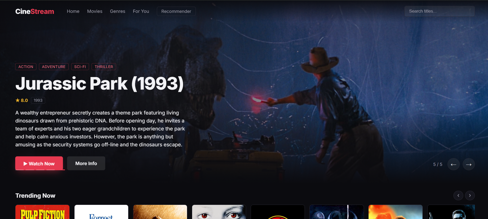
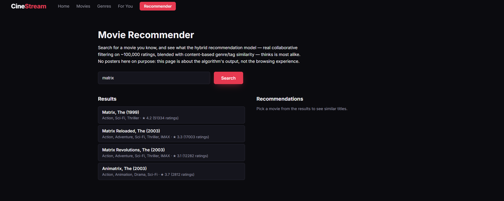
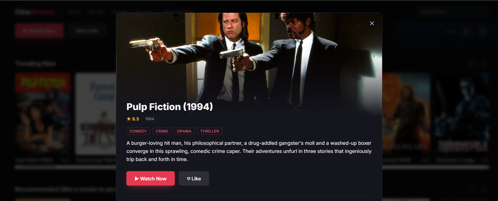
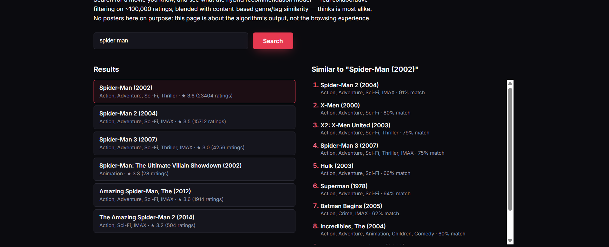

# 🎬 CineStream

**CineStream** is a Netflix/Prime-style movie streaming browser with a genuine hybrid recommendation system underneath it — built on real collaborative filtering over MovieLens ratings, blended with content-based similarity, and enriched with live poster/overview data from TMDB.

Unlike a typical portfolio recommender that leans on a single API's popularity score, CineStream separates *data* from *presentation*: MovieLens supplies a real user-item rating matrix (the thing that makes genuine collaborative filtering possible), while TMDB supplies nothing but images and text — it never decides what gets recommended.

---

## 🌐 Live Demo

[](#)

🚀 **Live link coming soon — deploying to Render.**

> Once deployed, the free-tier instance may take 30-60 seconds to wake up after inactivity.

---

## 🔬 What's Actually Happening Here

Two datasets, doing two different jobs:

* **[MovieLens ml-latest-small](https://grouplens.org/datasets/movielens/)** — a compact dataset with real user ratings, movie metadata, tags, and TMDB links. This is the *source of truth* for the catalog and the thing that makes real collaborative filtering possible: an actual user-item rating matrix, not a proxy. The dataset can be changed with `MOVIELENS_DATA_URL` for larger deployments.
* **[TMDB](https://www.themoviedb.org/documentation/api)** — supplies poster images, backdrop images, and overview text. Nothing more. It never decides what's recommended.

The two are joined via MovieLens's own `links.csv`, which maps every MovieLens movie to its TMDB id.

**Why split it this way instead of just using TMDB for everything?** TMDB's public API doesn't expose real per-user rating histories, so there's no genuine collaborative-filtering signal available from it alone. MovieLens gives real user behavior to model; TMDB makes it look good.

---

## ✨ Features

* 🎯 **Hybrid Recommendation Engine**

  * Real collaborative filtering (SVD over a MovieLens user-rating matrix) blended with content-based similarity (TF-IDF over genres + user tags).

* 🍿 **Netflix-Style Browsing**

  * Auto-rotating hero carousel, horizontal scrollable rows (Trending, Top Rated, genre rows), and a click-through detail modal.

* ❤️ **Real Personalization, No Login Required**

  * An anonymous browser ID tracks your likes, and "Recommended For You" recomputes from your *actual* likes every time you like or unlike a movie.

* 🔍 **Standalone Recommender Page**

  * A dedicated page for exploring the model directly — search a movie, get a plain ranked list of similar titles, no posters, just the algorithm's output.

* 🖼️ **Lazy TMDB Enrichment**

  * Poster/backdrop/overview data is fetched from TMDB only the first time a movie is actually viewed, then cached — not fetched for the entire ~27,000-movie catalog up front.

* ⚡ **Cached Model Training**

  * The ML service trains once from raw MovieLens CSVs and caches the trained model to disk — restarts load instantly instead of retraining.

* 🐳 **Docker Support**

  * All three services can be built and run with Docker Compose.

---

## 🏗️ Architecture

```
┌─────────────┐      REST       ┌──────────────┐      REST       ┌──────────────────────┐
│   React     │ ───────────────▶│  Spring Boot │ ───────────────▶│  Python (Flask)       │
│  Frontend   │◀─────────────── │   Backend    │◀─────────────── │  ML Service           │
└─────────────┘                 └──────┬───────┘                 │  (owns MovieLens data)│
                                        │                          └──────────────────────┘
                                        ▼
                                ┌──────────────┐
                                │  TMDB API    │
                                │ (enrichment  │
                                │  only)       │
                                └──────────────┘
```

* **ML service** loads the full MovieLens dataset once at startup and builds two models: TF-IDF content similarity (genres + user tags) and item-level latent factors from collaborative filtering (Truncated SVD over the real rating matrix). Similarity is computed on demand per query — not precomputed for the whole catalog, which at ~27,000 movies would take several gigabytes of memory.
* **Backend** is the only thing the frontend talks to. It asks the ML service for movie data and recommendations (by MovieLens id), then lazily enriches whatever's actually being displayed with a TMDB poster/overview — and caches that enrichment in its own database so it only ever calls TMDB once per movie, not once per request.
* **Frontend** has two views: the main Netflix-style browser (posters, hero carousel, "Recommended For You"), and a standalone Recommender page — search a movie, get a plain ranked list back, no poster images, useful for seeing the model's output directly.

### Why lazy enrichment, not "enrich everything up front"

Calling TMDB for all ~27,000 movies at startup would be slow, wasteful (most of that catalog is never viewed by anyone), and vulnerable to rate limits. Instead, the backend enriches a movie the first time it's actually shown to a user and caches the result — so the ~150 most-rated movies get enriched proactively at startup (for a populated homepage), and everything else enriches on-demand the moment someone searches for it or it shows up in a recommendation.

### Personalization without a login system

There's no login system. Instead, a random anonymous ID is generated in the browser (`localStorage`) the first time you visit. Liking a movie (heart icon) saves that like against your anonymous ID in the backend's database, and "Recommended For You" is recomputed from your actual likes — not from what's merely trending — every time you like or unlike something.

---

## 🧠 Recommendation Workflow

```text
User searches or likes a movie
        │
        ▼
Spring Boot Backend receives the request
        │
        ▼
Python ML Service (owns the MovieLens dataset)
        │
        ├── Content similarity: TF-IDF over genres + tags
        ├── Collaborative filtering: SVD over real user ratings
        └── Hybrid blend of both, computed on demand
        │
        ▼
Ranked movie IDs returned to backend
        │
        ▼
Backend enriches with TMDB poster/overview
(only for movies not already cached)
        │
        ▼
Ranked, enriched recommendations shown to user
```

The recommendation logic never precomputes a full similarity grid between every movie — at ~27,000 movies that would be several gigabytes of memory. Instead, similarity is computed on demand for just the one movie being queried, against the rest of the catalog.

---

## 🛠️ Technology Stack

### Frontend

* **React** + **Vite**
* **Axios**

### Backend

* **Java** + **Spring Boot**
* **Spring Data JPA**
* **H2** (in-memory database, used as a TMDB enrichment cache)

### Machine Learning / Data

* **Python** + **Flask**
* **pandas**, **scikit-learn** (TF-IDF, Truncated SVD, cosine similarity)
* **MovieLens ml-latest-small** dataset by default (the dataset URL is configurable)
* **TMDB API** (poster/backdrop/overview enrichment only)

### Deployment

* **Docker** + **Docker Compose**
* **Render**

---

## 📁 Project Structure

```text
movie-recommender/
├── ml-service/
│   ├── app.py
│   ├── recommender.py
│   ├── model_cache.py
│   ├── download_data.py
│   ├── requirements.txt
│   ├── Dockerfile
│   └── data/               # MovieLens CSVs — downloaded, not committed
│
├── backend/
│   ├── src/main/java/com/movierecommender/backend/
│   │   ├── controller/
│   │   ├── service/
│   │   ├── model/
│   │   ├── dto/
│   │   └── config/
│   ├── src/main/resources/
│   │   ├── application.properties
│   │   └── application-local.properties   # your TMDB key — gitignored
│   ├── pom.xml
│   └── Dockerfile
│
├── frontend/
│   ├── src/
│   │   ├── components/
│   │   ├── api/
│   │   └── data/
│   ├── package.json
│   └── Dockerfile
│
├── docker-compose.yml
├── render.yaml
├── README.md
├── BUILD_LOG.md
└── LICENSE
```

---

---

## 🖥️ Application Screenshots

> Add your screenshots to `docs/screenshots/` using the filenames below.

### 🏠 Home



### 🔍 Search



### 🎬 Movie Details



### 🧠 Standalone Recommender Page



---

## 🚀 Getting Started

### Prerequisites

* **Python 3.10+**
* **Java 17+** and **Maven**
* **Node.js 18+**
* **Git**

### 1. Clone the repository

```bash
git clone https://github.com/<your-username>/movie-recommender.git
cd movie-recommender
```

### 2. Get the MovieLens dataset

```bash
cd ml-service
python download_data.py
```

This downloads the default MovieLens small dataset from GroupLens into `ml-service/data/`. One-time step. The Docker build performs this automatically for Render.

### 3. Get a free TMDB API key

No credit card required — [themoviedb.org/settings/api](https://www.themoviedb.org/settings/api). You only need the "API Key (v3 auth)".

### 4. Configure your key locally (never commit it)

Create `backend/src/main/resources/application-local.properties`:

```properties
tmdb.api.key=YOUR_KEY_HERE
```

This file is already listed in `.gitignore`.

### 5. Start all three services (separate terminals)

**ML service:**

```bash
cd ml-service
pip install -r requirements.txt
python app.py
# http://localhost:5001 — first run trains the model and caches it to disk;
# expect this to take a while the very first time, then be fast afterward.
```

**Backend:**

```bash
cd backend
```

Windows (PowerShell):

```powershell
$env:SPRING_PROFILES_ACTIVE="local"
mvn spring-boot:run
```

macOS/Linux:

```bash
export SPRING_PROFILES_ACTIVE=local
mvn spring-boot:run
```

```text
# http://localhost:8080
```

**Frontend:**

```bash
cd frontend
npm install
npm run dev
# http://localhost:5173
```

If the frontend can't reach the backend, it automatically falls back to demo data (with a visible banner) so the UI stays explorable mid-setup.

---

## 🔄 Rebuilding the Model Cache

The ML service caches its trained model to `ml-service/data/model_cache.pkl` after the first run. To force a full retrain (e.g. after changing the dataset or the model code):

```bash
cd ml-service
rm data/model_cache.pkl   # Windows: del data\model_cache.pkl
python app.py
```

The cache also invalidates itself automatically if the source CSVs change.

---

## 🐳 Run with Docker

Make sure Docker Desktop is installed.

```bash
export TMDB_API_KEY="your-real-key-here"   # PowerShell: $env:TMDB_API_KEY="your-real-key-here"
docker-compose up --build
```

Then open:

```text
http://localhost:3000
```

The ML service's Docker image bakes both the MovieLens dataset **and the trained model cache** in at build time — meaning the container starts fast even on hosts that reset the filesystem between restarts (see the free-tier note in Deployment below).

---

## 🔐 Configuration

Your TMDB API key must **never** be committed to the repository. Locally, it lives in `backend/src/main/resources/application-local.properties` (gitignored). For deployment, set `TMDB_API_KEY` as a real environment variable on your hosting platform instead.

---

## 📡 API Reference

**Browsing (enriched with TMDB posters):**

| Method | Endpoint | Description |
|---|---|---|
| GET | `/api/movies/trending?limit=` | Real popularity — ranked by actual MovieLens rating count |
| GET | `/api/movies/top-rated?limit=` | Ranked by actual average rating |
| GET | `/api/movies/genre/{genre}` | Filter by MovieLens genre label (e.g. `Sci-Fi`, not `Science Fiction`) |
| GET | `/api/movies/search?q=` | Title search, enriched results |
| GET | `/api/movies/{id}` | Single movie, enriches on first access |
| GET | `/api/recommendations/movie/{id}?topN=` | Similar movies, hybrid model, enriched |
| GET | `/api/recommendations/profile?likedIds=1,2,3&topN=` | Personalized recommendations from liked movie IDs |

**Likes (personalization):**

| Method | Endpoint | Description |
|---|---|---|
| GET | `/api/users/{userId}/likes` | This user's liked movies |
| POST | `/api/users/{userId}/likes/{movieId}` | Like a movie |
| DELETE | `/api/users/{userId}/likes/{movieId}` | Unlike a movie |

**Lite (no TMDB enrichment — powers the standalone Recommender page):**

| Method | Endpoint | Description |
|---|---|---|
| GET | `/api/movies/search/lite?q=` | Plain title/genre/rating search, no images |
| GET | `/api/recommendations/lite/movie/{id}?topN=` | Plain recommendation list, no images |

---

## ☁️ Deployment

Docker + `docker-compose.yml`/`render.yaml` are set up for all three services. To deploy on Render:

1. Create a new **Blueprint** from this GitHub repository and select the root `render.yaml`.
2. When Render prompts for `TMDB_API_KEY`, enter the key as a secret value. Never commit it.
3. Render creates the ML, backend, and frontend services. The backend uses the ML service's private `host:port`.
4. The frontend build uses `https://moviestream-backend.onrender.com` as its API URL, matching the backend service name in `render.yaml`.

If the service names are changed in Render, update the frontend `VITE_API_BASE_URL` value before rebuilding the frontend.

**Free-tier hosting note:** platforms like Render's free tier spin services down after inactivity and restart them with a fresh filesystem. The ML service's Dockerfile downloads the configured dataset and bakes the trained model cache into the image, so a cold restart does not need to download or retrain the model. The default small dataset is intentional for low-memory hosting. Use the full `ml-20m` dataset only with a larger service and a separately managed model artifact.

---

## 📄 License & Citation

MIT — see [LICENSE](./LICENSE).

The MovieLens dataset itself has its own terms (research/educational use, no redistribution as a standalone dataset) — see [GroupLens's dataset page](https://grouplens.org/datasets/movielens/) if you plan to reuse the data beyond this project.

This project uses the MovieLens dataset:

> F. Maxwell Harper and Joseph A. Konstan. 2015. The MovieLens Datasets: History and Context. ACM Transactions on Interactive Intelligent Systems (TiiS) 5, 4: 19:1–19:19. https://doi.org/10.1145/2827872

---

## 🔮 Future Improvements

Potential areas for further development:

* Real user accounts, so likes persist across devices instead of relying on browser storage
* Offline evaluation metrics (RMSE / precision@k) for the recommendation model
* Move the TMDB enrichment cache to Redis for multi-instance scaling
* Periodic refresh of stale TMDB data (posters/ratings can change over time)
* A live/rolling rating source, since MovieLens benchmark ratings are historical
* Automated test suite (unit tests for the recommender, integration tests for the API)

---

## 👨‍💻 Author

**Mithilesh A**

Software Developer

---

## ⭐ Project

If you find CineStream useful or interesting, consider giving the repository a ⭐ on GitHub.

**CineStream — a Netflix-style movie browser powered by a real hybrid recommendation system.**
